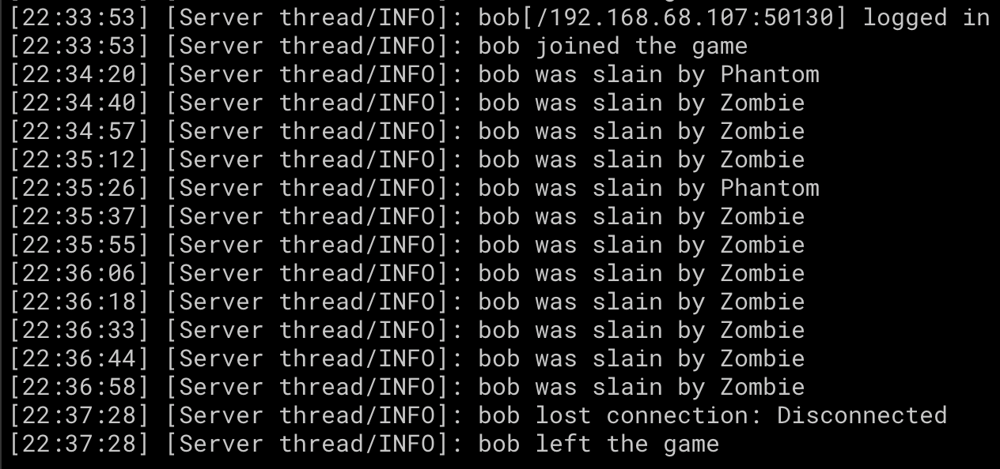

<!-- BEGIN:AVATAR -->

<!-- END:AVATAR -->

<!-- BEGIN:BADGES -->
[](https://github.com/littlegodzillalaboratory/minecraft-npc/actions?query=workflow%3ACI)
[](https://libraries.io/npm/minecraft-npc)
[](https://github.com/littlegodzillalaboratory/minecraft-npc/actions?query=workflow%3ACodeQL)
[](https://coveralls.io/r/littlegodzillalaboratory/minecraft-npc?branch=main)
[](https://snyk.io/test/github/littlegodzillalaboratory/minecraft-npc)
[](https://www.npmjs.com/package/minecraft-npc)
<!-- END:BADGES -->

# Minecraft NPC

Minecraft NPC is a CLI for running NPC bot on Minecraft, powered by [Mineflayer](https://prismarinejs.github.io/mineflayer/#/).



## Installation

```shell
npm install -g minecraft-npc
```

## Usage

Create a configuration file, e.g. `minecraft-npc.yaml`

Start Minecraft NPC bot:

```shell
minecraft-npc start --conf-file minecraft-npc.yaml
```

## Configuration

| Property | Description | Mandatory/Optional | Default Value |
|----------|-------------|--------------------|---------------|
| host | Minecraft server host | Optional | `localhost` |
| port | Minecraft server port | Optional | `25565` |
| version | Minecraft version | Mandatory | |
| viewer_port | Minecraft viewer port | Optional | `3000` |
| web_inventory_port | Minecraft web inventory port | Mandatory | |
| username | Minecraft username | Optional | `bob` |
| password | Minecraft password | Optional, only needed on online mode | |
| init_coords | Initial bot coordinates [x, y, z] | Optional | `[0, 0, 0]` |
| init_messages | Initial bot messages to send on spawn | Optional | |
| chatgpt_apikey | ChatGPT API key | Optional, only needed for ChatGPT chat feature | |
| chatgpt_model | [ChatGPT model](https://developers.openai.com/api/docs/models/all) to use | Optional | `gpt-5.2`  |
| chatgpt_instructions | ChatGPT bot instructions | Optional | |
| chatgpt_enable_moderation | Enable ChatGPT moderation of messages | Optional | `false` |
| chatgpt_enable_message_logging | Enable logging of ChatGPT messages | Optional | `false` |
| chatgpt_minimum_confidence_score | Minimum confidence score threshold for ChatGPT responses | Optional | |
| chatgpt_cool_down_in_seconds | Cool-down period in seconds between ChatGPT responses | Optional | |
| chatgpt_fallback_message | Message to send when ChatGPT cannot provide a response | Optional | |

## Debugging

To enable debug logs at protocol level, set `DEBUG="minecraft-protocol"` environment variable when running `minecraft-npc`. You'll get more detailed information when the program exits due to an error:

```text
Spawning bot...
    minecraft-protocol writing packet handshaking.set_protocol +0ms
    minecraft-protocol {
    minecraft-protocol   protocolVersion: 763,
    minecraft-protocol   serverHost: 'somehost',
    minecraft-protocol   serverPort: 25565,
    minecraft-protocol   nextState: 2
    minecraft-protocol } +1ms
    minecraft-protocol writing packet login.login_start +48ms
    minecraft-protocol {
    minecraft-protocol   username: 'someusername',
    minecraft-protocol   signature: null,
    minecraft-protocol   playerUUID: 'd3afe860-c1dd-3d13-8ec6-8680489964b0'
    minecraft-protocol } +0ms
    minecraft-protocol read packet login.disconnect +370ms
    minecraft-protocol {
    minecraft-protocol   "reason": "{\"translate\":\"multiplayer.disconnect.incompatible\",\"with\":[\"1.20.4\"]}"
    minecraft-protocol } +1ms
Bot has been kicked:
"{\"translate\":\"multiplayer.disconnect.incompatible\",\"with\":[\"1.20.4\"]}"
```

## Colophon

<!-- BEGIN:DEVELOPERS_GUIDE -->
[Developer's Guide](https://cliffano.github.io/developers-guide-nodejs.html)
<!-- END:DEVELOPERS_GUIDE -->

<!-- BEGIN:BUILD_REPORTS -->
Build reports:

* [Code complexity report](https://littlegodzillalaboratory.github.io/minecraft-npc/complexity/plato/index.html)
* [Unit tests report](https://littlegodzillalaboratory.github.io/minecraft-npc/test/mocha.txt)
* [Test coverage report](https://littlegodzillalaboratory.github.io/minecraft-npc/coverage/c8/index.html)
* [Integration tests report](https://littlegodzillalaboratory.github.io/minecraft-npc/test-integration/cmdt.txt)
* [API Documentation](https://littlegodzillalaboratory.github.io/minecraft-npc/doc/jsdoc/index.html)

<!-- END:BUILD_REPORTS -->

Related projects:

* [mineflayer-chatgpt](https://github.com/littlegodzillalaboratory/mineflayer-chatgpt) - Mineflayer plugin for sending and receiving messages with OpenAI ChatGPT
